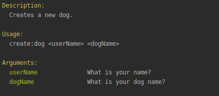
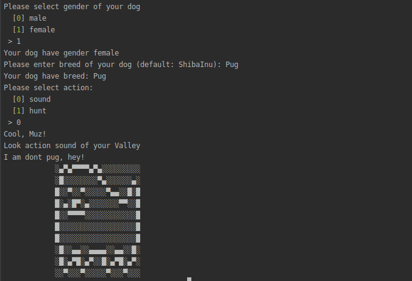
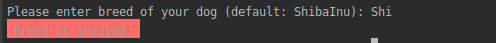
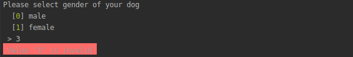

# Dogs
Это кастомизированный вариант выполнения [вот этого](https://github.com/devjsru/php_test) тестового задания.
## Породы
Обрати внимание на правильное написание пород собак: `ShibaInu`, `Pug`, `Dachshund`, а еще есть `RubberLabrador`
## Установка
В общем-то, стандартная:

`composer require muz4k/dogs`

## Что с этим делать?

 - Для начала ты можешь выполнить
`bin/console list`, где своим внимательным взглядом увидишь описание одной из команд:
   `create:dog - Creates a new dog.`
 - После чего, если захочешь узнать, что это за команда, можешь ввести:
 `bin/console create:dog --help`, чтобы увидеть:
 
   
 - Теперь можно начинать! Выбирай имя себе (да, так тоже можно) и своей будущей собаке и пиши!
 ## Игра
 Начнем-с! Введем, например,
 `bin/console create:dog Muz Valley`. 
 После чего появится интерактив, с помощью которого ты сможешь выбрать пол, породу и действие.
 Пород всего _четыре_, они написаны выше. Будь внимателен при выборе породы.
 Пример интерактива:
 
 
 
 Ну и конечно, никто не даст тебе оступиться:
  
  
  
  
  
  Такие дела. :)
  
